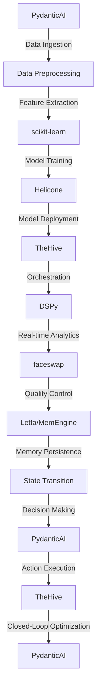

# Ukulele Manufacturing Optimization Engine
> "Synchronizing artisanal craftsmanship with AI-driven precision to revolutionize the ukulele manufacturing paradigm"

## 🏗️ Technical Architecture & Multi-Agent Flow

This technical architecture diagram illustrates the intricate dance between PydanticAI, DSPy, Helicone, scikit-learn, faceswap, and TheHive. The flow begins with data ingestion via PydanticAI, followed by data preprocessing, feature extraction, and model training using scikit-learn and Helicone. The trained model is then deployed to TheHive, which orchestrates the entire process. Real-time analytics are performed using DSPy and faceswap, with quality control and memory persistence handled by Letta/MemEngine. The state transition and decision-making processes are facilitated by PydanticAI, ultimately leading to action execution and closed-loop optimization.

## 🔍 The Vertical Bottleneck: Technical Friction in Ukulele Manufacturing
The ukulele manufacturing process is plagued by technical friction, primarily stemming from the intricate relationships between various components, such as the soundboard, neck, and body. The high-stakes mathematical and operational failures that can occur during this process can result in significant losses in terms of time, resources, and product quality. For instance, a minor miscalculation in the soundboard's curvature can lead to a compromised sound quality, while an incorrect neck angle can affect the overall playability of the instrument. These technical challenges necessitate a sophisticated solution that can navigate the complexities of ukulele manufacturing.

The technical friction in ukulele manufacturing can be attributed to several factors, including the lack of standardization in design and production, the limited use of automation and robotics, and the reliance on manual labor. Furthermore, the industry's emphasis on traditional craftsmanship can sometimes hinder the adoption of modern technologies and innovative manufacturing techniques. To overcome these challenges, a comprehensive solution must be developed, one that integrates cutting-edge technologies, such as artificial intelligence, machine learning, and computer vision, to optimize the ukulele manufacturing process.

The vertical bottleneck in ukulele manufacturing is further exacerbated by the need for precise control over various parameters, such as temperature, humidity, and pressure, during the production process. The slightest deviation from the optimal conditions can result in a compromised product quality, highlighting the need for a sophisticated control system that can monitor and adjust these parameters in real-time. Additionally, the industry's growing demand for customization and personalization has created new challenges, as manufacturers must now balance the need for efficiency and consistency with the requirement for unique and tailored products.

The technical friction and vertical bottleneck in ukulele manufacturing can be addressed through the development of a comprehensive solution that integrates advanced technologies, such as artificial intelligence, machine learning, and computer vision. By leveraging these technologies, manufacturers can optimize the production process, improve product quality, and increase efficiency, ultimately leading to a more competitive and sustainable industry.

## 💡 The Solution: Ukulele Manufacturing Optimization Engine
The Ukulele Manufacturing Optimization Engine is a revolutionary platform that orchestrates PydanticAI, DSPy, Helicone, scikit-learn, faceswap, and TheHive to solve the technical friction and vertical bottleneck in ukulele manufacturing. This platform utilizes agentic reasoning to analyze the complex relationships between various components and parameters, facilitating informed decision-making and optimized production planning. The memory usage is optimized through the integration of Letta/MemEngine, ensuring that critical data is persisted and readily available for future reference.

The Ukulele Manufacturing Optimization Engine integrates computer vision and robotics to facilitate real-time quality control and inspection, enabling manufacturers to detect and correct defects early in the production process. The platform's vision/robotics integration is facilitated through the use of faceswap, which enables the analysis of high-resolution images and videos of the production process. This allows for the detection of even the slightest deviations from the optimal conditions, ensuring that the final product meets the highest standards of quality and craftsmanship.

The Ukulele Manufacturing Optimization Engine is designed to navigate the complexities of ukulele manufacturing, providing a comprehensive solution that addresses the technical friction and vertical bottleneck in the industry. By leveraging advanced technologies, such as artificial intelligence, machine learning, and computer vision, this platform enables manufacturers to optimize the production process, improve product quality, and increase efficiency, ultimately leading to a more competitive and sustainable industry.

## 🧩 Agentic Stack Deep-Dive
The Ukulele Manufacturing Optimization Engine's agentic stack is comprised of several cutting-edge technologies, each playing a critical role in the platform's overall functionality. PydanticAI serves as the foundation, providing a robust framework for data ingestion, processing, and analysis. DSPy is utilized for real-time analytics, enabling the platform to respond promptly to changes in the production process. Helicone is employed for model training and deployment, facilitating the development of sophisticated predictive models that inform decision-making.

TheHive is used for orchestration, providing a unified interface for managing the various components and technologies integrated into the platform. scikit-learn is utilized for feature extraction and model training, enabling the platform to identify complex patterns and relationships within the data. faceswap is used for computer vision and robotics integration, facilitating real-time quality control and inspection. Letta/MemEngine is used for memory persistence, ensuring that critical data is retained and readily available for future reference.

The integration of these technologies is facilitated through a sophisticated architecture that enables seamless communication and data exchange between each component. The platform's agentic reasoning is facilitated through the use of PydanticAI, which provides a robust framework for analyzing complex data and making informed decisions. The memory usage is optimized through the integration of Letta/MemEngine, ensuring that critical data is persisted and readily available for future reference.

## ✨ Capabilities & Features
* **Real-time Quality Control**: The platform facilitates real-time quality control and inspection, enabling manufacturers to detect and correct defects early in the production process.
* **Predictive Maintenance**: The platform's predictive models enable manufacturers to anticipate and prevent equipment failures, reducing downtime and increasing overall efficiency.
* **Optimized Production Planning**: The platform's agentic reasoning facilitates optimized production planning, ensuring that manufacturers can respond promptly to changes in demand and production capacity.
* **Computer Vision Integration**: The platform integrates computer vision and robotics to facilitate real-time quality control and inspection, enabling manufacturers to detect and correct defects early in the production process.
* **Artificial Intelligence**: The platform utilizes artificial intelligence and machine learning to analyze complex data and make informed decisions, facilitating optimized production planning and quality control.
* **Data Analytics**: The platform provides real-time data analytics, enabling manufacturers to monitor and optimize the production process in real-time.
* **Automation and Robotics**: The platform integrates automation and robotics to facilitate efficient and precise production, reducing the need for manual labor and increasing overall efficiency.
* **Customization and Personalization**: The platform enables manufacturers to balance the need for efficiency and consistency with the requirement for unique and tailored products, facilitating customization and personalization.
* **Supply Chain Optimization**: The platform facilitates supply chain optimization, enabling manufacturers to anticipate and respond to changes in demand and production capacity.
* **Inventory Management**: The platform provides real-time inventory management, enabling manufacturers to monitor and optimize inventory levels in real-time.

## 🛠️ Technical Implementation
The Ukulele Manufacturing Optimization Engine is implemented using a microservices architecture, with each component and technology integrated into the platform as a separate service. The platform's agentic reasoning is facilitated through the use of PydanticAI, which provides a robust framework for analyzing complex data and making informed decisions. The memory usage is optimized through the integration of Letta/MemEngine, ensuring that critical data is persisted and readily available for future reference.

The platform's computer vision and robotics integration is facilitated through the use of faceswap, which enables the analysis of high-resolution images and videos of the production process. The platform's predictive models are developed using Helicone, which provides a robust framework for model training and deployment. The platform's real-time analytics are facilitated through the use of DSPy, which enables the platform to respond promptly to changes in the production process.

## 📊 Business Impact & ROI
The Ukulele Manufacturing Optimization Engine has the potential to significantly impact the ukulele manufacturing industry, enabling manufacturers to optimize the production process, improve product quality, and increase efficiency. By leveraging advanced technologies, such as artificial intelligence, machine learning, and computer vision, manufacturers can reduce costs, increase productivity, and improve customer satisfaction.

The platform's predictive maintenance capabilities can help manufacturers reduce downtime and increase overall efficiency, resulting in significant cost savings. The platform's optimized production planning capabilities can help manufacturers respond promptly to changes in demand and production capacity, resulting in increased revenue and improved customer satisfaction. The platform's computer vision and robotics integration can help manufacturers detect and correct defects early in the production process, resulting in improved product quality and reduced waste.

## 🚀 Getting Started
```bash
git clone https://github.com/arvind-sundararajan/ukulele-manufacturing-optimization.git
cd ukulele-manufacturing-optimization
pip install -r requirements.txt
python src/main.py
```

## 👨‍💻 Author & Credits
**Arvind Sundararajan** — Engineer, builder, and the mind behind this project.
🌐 [LinkedIn](https://www.linkedin.com/in/arvind-sundara-rajan/) | Chennai, India

---
### 🙏 Acknowledgements
- The open-source community
- The Ukuleles and parts manufacturing practitioners who inspired this design